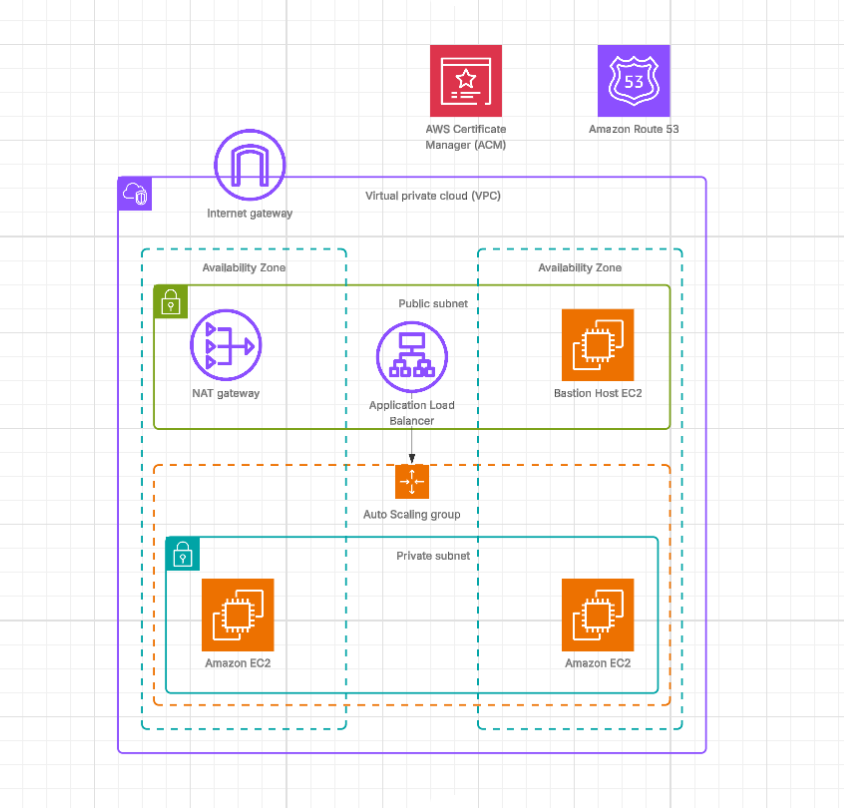

# 🌐 Infrastructure as Code: Scalable Web Hosting Architecture with AWS and Terraform

This project demonstrates how to host a secure and scalable website on AWS using EC2 instances in private subnets, an Internet-Facing Application Load Balancer (ALB), Auto Scaling Group (ASG), and Route 53 + AWS Certificate Manager (ACM) for domain management and HTTPS support — all managed with Terraform infrastructure as code (IaC).

## 🚀 Features
- Fully automated infrastructure deployment using Terraform
- EC2 instances launched in private subnets via Auto Scaling Group
- Internet-facing Application Load Balancer (ALB) routing traffic to private instances
- Custom domain name managed through Route 53
- SSL/TLS certificate provisioning via AWS Certificate Manager (ACM)
- Secure HTTPS access for end users
- Highly available and scalable architecture
- Infrastructure follows best security practices

## ⚙️ Key Components

### ✅ VPC and Networking
- **VPC**: Custom Virtual Private Cloud configured with four subnets — two public and two private — across two Availability Zones.
- **Public Subnets**: Host the Internet-facing Load Balancer and a Bastion Host for secure administration.
- **Private Subnets**: Host EC2 instances that are not directly exposed to the internet.
- **Routing**: 
  - Public subnets route to the **Internet Gateway**.
  - Private subnets route to the internet via **NAT Gateway** in the public subnet.

---

### ✅ Internet Gateway and NAT Gateway
- **Internet Gateway**: Enables internet access for the Load Balancer and Bastion Host.
- **NAT Gateway**: Allows instances in private subnets to reach the internet securely for updates and patches.

---

### ✅ Load Balancer and Auto Scaling
- **Application Load Balancer (ALB)**: Deployed in public subnets, it routes external HTTPS traffic to EC2 instances in private subnets.
- **Auto Scaling Group (ASG)**: Dynamically manages EC2 instances to handle varying workloads, ensuring high availability and fault tolerance.

---

### ✅ Route 53 and ACM
- **Route 53**: Manages the custom domain name and routes DNS traffic to the Load Balancer.
- **AWS Certificate Manager (ACM)**: Provides SSL certificates for secure HTTPS access.

---

### ✅ Bastion Host
- **Purpose**: Provides SSH access to EC2 instances in private subnets.
- **Location**: Deployed in a public subnet with tightly restricted IP access.

---

